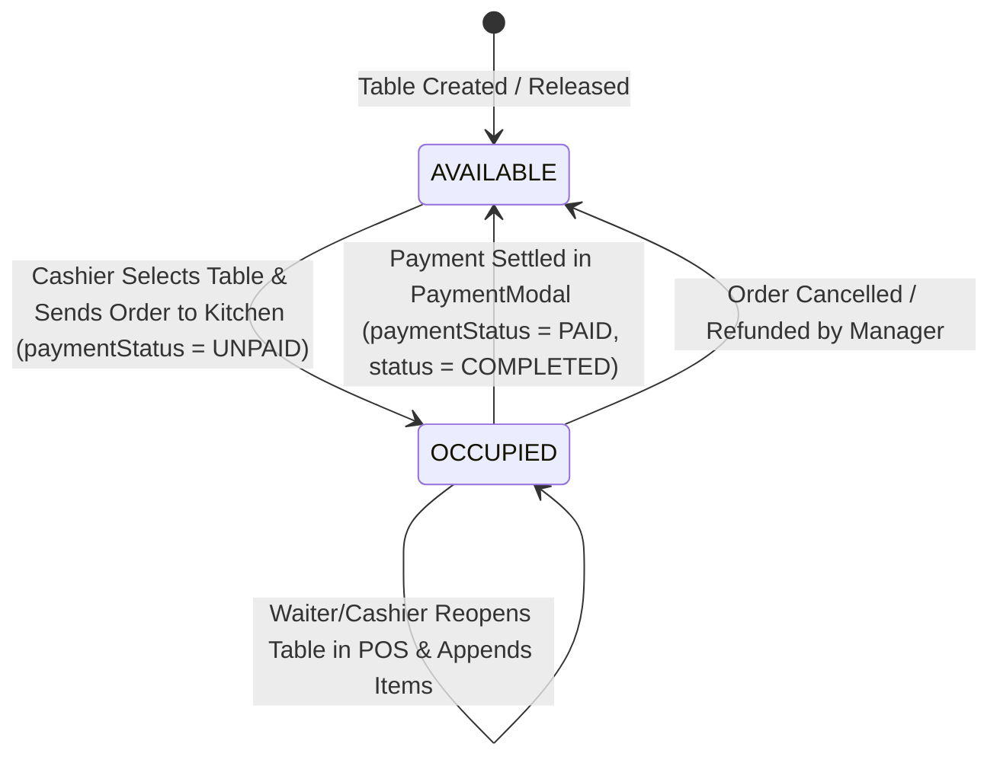

# Urban Spice — Point of Sale (POS) & Restaurant Management System
## Complete Technical, Functional & Operational Documentation (100% Offline-First Architecture)

---

## 1. Executive Overview

### What is Urban Spice?
**Urban Spice** is a full-stack, enterprise-grade **Point of Sale (POS), Kitchen Display (KDS), Table Management, Inventory, and Restaurant Management System** built specifically for high-volume pizza parlors, fast-food outlets, and dine-in/takeaway restaurants.

The platform is designed around the real-world operational workflows of **Urban Spice Pizza & Restaurant** (located at *180 F, Near Klash Park, Millat Town, Faisalabad*), providing a frictionless point of sale terminal, dine-in table status tracking, kitchen queue management, multi-tier pricing matrices for pizzas of varying sizes, customer relationship management (CRM), raw material stock tracking, financial analytics, and store customization.

### Primary Capabilities & Core Purpose
- **100% Offline Operation:** Operates without any internet connection using a locally hosted MongoDB database server (`mongodb://127.0.0.1:27017/urban_spice`).
- **Dine-In Table Management:** Real-time visual table selector with status indicators (`AVAILABLE`, `OCCUPIED`, `RESERVED`), seat capacity, and open tab bill previews.
- **Open Table Orders (Hold Tab to KDS):** Waiters/cashiers can send dine-in food to the kitchen immediately upon ordering before collecting payment.
- **Instant POS & Billing:** Fast touch/keyboard-driven counter checkout with support for Dine-In and Takeaway orders.
- **Complex Pizza Configuration:** Multi-size flavor matrices (Small, Medium, Large, X-Large), specialty crusts (Pan, Thin, Cheese Stuffed), and dynamic multi-size extra toppings.
- **Dedicated Food Customizers:** Modals for customizing Pizzas, Pastas, Sandwiches, Burgers, Loaded Fries, Wings, and Beverages with customizable add-ons and special cooking instructions.
- **Kitchen Display System (KDS):** Live digital Kanban board showing order stages (`PENDING` -> `PREPARING` -> `READY`) with real-time local polling.
- **Order Tracking & Edit Suite:** Filter orders by date range or status, modify active orders, and re-print receipts.
- **Thermal Receipt Printing:** Standardized 80mm & 58mm printable thermal receipt layouts formatted with store branding, table number, cashier info, tax breakdown, and change calculations.
- **Raw Material Inventory & Stock Control:** Track ingredient units, log stock adjustments (Purchases, Waste, Additions, Removals), and monitor low-stock alerts.
- **Customer CRM & Order History:** Automated phone-based customer registry that tracks lifetime spend, total orders, and favorite meals.
- **Financial Analytics & Reporting:** Daily, weekly, monthly, and yearly revenue tracking, estimated profit calculations, payment method distribution, CSV exports, and daily sales cycle (`SalesDay`) management.
- **Role-Based Access Control (RBAC):** Dedicated permissions for `ADMIN`, `MANAGER`, and `CASHIER` accounts.

---

## 2. Technology Stack & Architecture

### Core Stack
| Layer | Technology | Version | Purpose |
| :--- | :--- | :--- | :--- |
| **Framework** | Next.js (App Router) | 16.x | Fullstack React framework with SSR and Route Handlers |
| **UI Library** | React | 19.x | Component lifecycle and reactive state |
| **Database** | MongoDB | 6.x+ (Local) | Fast, local document database running at `127.0.0.1:27017` |
| **ORM** | Prisma ORM | 6.x | Native schema modeling, migrations, and database queries |
| **Styling** | Tailwind CSS | 3.4.x | Dark-mode tailored styling with responsive design |
| **Language** | TypeScript | 5.7.x | Static typing across server actions, APIs, and client UI |
| **Icons** | Lucide React | 0.475+ | Streamlined iconography |
| **Forms & Validation** | React Hook Form + Zod | 7.x / 3.x | Schema-driven client and server-side validation |
| **Authentication** | JWT (`jose`) + `bcryptjs` | 6.x / 3.x | Cookie-based stateless local authentication & password hashing |
| **Media Management** | Local Filesystem Storage | Node.js `fs` | Direct image storage in `public/uploads/` (Zero cloud dependencies) |
| **Toast Notifications** | Sonner | 2.x | High-performance toast alerts |

---

## 3. System Architecture & Directory Structure

```
urban-spice/
├── .env.example                  # Local environment configuration template
├── package.json                  # Dependencies, build scripts & Prisma commands
├── tsconfig.json                 # TypeScript compiler configuration
├── tailwind.config.ts            # Tailwind styling tokens and animations
├── prisma/
│   ├── schema.prisma             # MongoDB database schema and model definitions
│   └── seed.ts                   # Official database initialization & menu seed script
└── src/
    ├── middleware.ts             # Route protection and role-based redirect engine
    ├── app/
    │   ├── layout.tsx            # Global HTML root layout with AppProvider & Sonner Toaster
    │   ├── globals.css           # Global Tailwind directives and print media CSS rules
    │   ├── page.tsx              # Root landing redirector (evaluates session -> /pos or /login)
    │   ├── login/page.tsx        # Staff authentication portal
    │   ├── pos/page.tsx          # Fast Point-of-Sale billing & table selection terminal
    │   ├── kitchen/page.tsx      # Kitchen Display System (KDS Kanban board)
    │   ├── orders/page.tsx       # Orders history, status management & receipt viewer
    │   ├── products/page.tsx     # Products catalog & category manager (Admin/Manager)
    │   ├── pizza-management/page.tsx # Pizza flavor, size, crust & topping pricing matrices
    │   ├── inventory/page.tsx    # Raw inventory & ingredient stock adjustments
    │   ├── customers/page.tsx    # Customer CRM, profile drawers & lifetime analytics
    │   ├── employees/page.tsx    # Staff user administration & role assignment (Admin only)
    │   ├── reports/page.tsx      # Sales analytics, financial KPIs, CSV export & daily shift
    │   ├── settings/page.tsx     # Shop configuration, branding & restaurant tables configuration
    │   └── api/                  # Backend Next.js Route Handlers (REST endpoints)
    │       ├── auth/             # Login, Logout, and Session (`/me`) endpoints
    │       ├── categories/       # Category CRUD
    │       ├── products/         # Product catalog CRUD
    │       ├── pos/              # High-speed read-only POS data feeds
    │       ├── tables/           # Restaurant Tables CRUD (`/api/tables`, `/api/tables/[id]`)
    │       ├── orders/           # Order placement, status updates, bill settlement
    │       ├── pizza-management/ # Flavors, Sizes, Crusts, Toppings endpoints
    │       ├── inventory/        # Raw material stock transactions
    │       ├── customers/        # Customer search & profiles
    │       ├── employees/        # Staff account creation, updating, deletion
    │       ├── reports/          # Financial summaries, sales trends, new sales day
    │       ├── settings/         # Store operational settings get/set
    │       ├── upload/           # Local file uploader (`public/uploads`)
    │       └── audit-logs/       # System activity audit logs
    ├── columns/                  # TanStack/React Table column definitions for all modules
    ├── components/
    │   ├── Navbar.tsx            # Application header with real-time clock & quick actions
    │   ├── Sidebar.tsx           # Role-filtered persistent desktop sidebar & mobile drawer
    │   ├── ImageUploadInput.tsx  # Local dropzone image uploader
    │   ├── OrderEditModal.tsx    # Full order modification and line item editor
    │   ├── POS/
    │   │   ├── ProductGrid.tsx              # Touch-optimized product selector with search
    │   │   ├── CartSidebar.tsx              # Dine-In & Takeaway cart with Kitchen & Settle actions
    │   │   ├── TableSelectorModal.tsx       # Visual table selection & active tab reopening
    │   │   ├── CustomizationModal.tsx       # Multi-size Pizza pricing & toppings configurator
    │   │   ├── PastaCustomizationModal.tsx  # Pasta, Sandwich, Burger & Fries customizer
    │   │   ├── DrinkCustomizationModal.tsx  # Drink flavor & size selector
    │   │   ├── CustomerModal.tsx            # Walk-in or CRM customer selector
    │   │   ├── PaymentModal.tsx             # Cash tender, change calculator & bill settlement
    │   │   └── ThermalReceiptModal.tsx      # 80mm/58mm printable thermal receipt view
    │   └── ui/                   # Reusable UI component library (Button, Modal, Input, DataTable)
    ├── context/
    │   └── AppContext.tsx        # Central state provider with reactive local API refreshers
    └── lib/
        ├── auth.ts               # Server session extraction helper
        ├── jwt.ts                # Stateless JWT sign/verify engine
        ├── prisma.ts             # Global singleton Prisma client
        ├── types.ts              # System-wide TypeScript interface definitions
        └── utils.ts              # Formatting utilities (currency, dates, invoices, styles)
```

---

## 4. Restaurant Dine-In & Table Lifecycle



---

## 5. Installation, Setup & Local Running Guide

### Prerequisites
- **Node.js**: v18.18.0 or v20+ / v22+
- **Package Manager**: `npm`
- **Database**: Local MongoDB Community Server running at `127.0.0.1:27017`

### Step 1: Start Local MongoDB with Replica Set
Prisma uses transactions for nested operations and relations. Initialize your local MongoDB replica set:
```bash
# 1. Enable replication in /usr/local/etc/mongod.conf:
# replication:
#   replSetName: rs0

# 2. Restart MongoDB service:
brew services restart mongodb-community

# 3. Initiate the replica set:
mongosh --eval "rs.initiate()"
```

### Step 2: Configure Environment Variables
In `.env`:
```env
DATABASE_URL="mongodb://127.0.0.1:27017/urban_spice?replicaSet=rs0&directConnection=true"
JWT_SECRET="super-secret-pizza-pos-jwt-token-2026-key"
```

### Step 3: Seed Official Menu & Default Accounts
```bash
npm run db:seed
```

#### Default Staff Credentials:
- **Administrator Account:**
  - **Email:** `admin@urbanspice.com`
  - **Password:** `admin123`
  - **Role:** `ADMIN`
- **Cashier Account:**
  - **Email:** `cashier@urbanspice.com`
  - **Password:** `cashier123`
  - **Role:** `CASHIER`

### Step 4: Run Locally
```bash
npm run dev
```
Open [http://localhost:3000](http://localhost:3000) in your browser.

---

## 6. Hardware & Thermal Receipt Printing

1. Connect your 80mm or 58mm USB/Ethernet thermal printer to the POS terminal.
2. In browser print settings:
   - **Destination:** Select your thermal receipt printer.
   - **Paper size:** Set to `80mm x 297mm` or `Roll 80mm / 58mm`.
   - **Margins:** Set to `None` or `Minimum`.
   - **Options:** Uncheck *Headers and footers*, check *Background graphics*.
3. When an order completes, click **Print Receipt** to immediately print the ticket.
